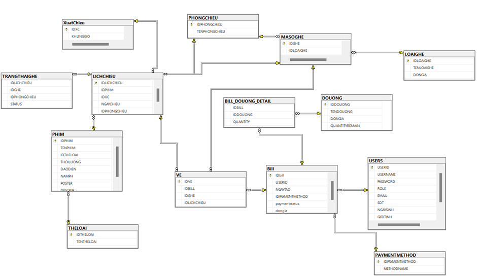

# 🎬 WebCinema - Hệ Thống Đặt Vé Xem Phim Trực Tuyến



<div align="center">

<div align="center">


[](https://github.com/TranDucLong040904)

</div>

</div>

---

## 📖 Giới Thiệu

**WebCinema** là một nền tảng đặt vé xem phim trực tuyến được xây dựng nhằm hiện đại hóa quy trình vận hành rạp chiếu phim. Dự án mô phỏng quy trình thực tế từ việc tìm kiếm phim, xem trailer, chọn suất chiếu, chọn ghế ngồi thời gian thực (Real-time) đến thanh toán hóa đơn.

## 👨‍💻 Về Tác Giả

Dự án được phát triển và duy trì bởi:

| Avatar | Thông tin | Liên hệ |
| :---: | :--- | :--- |
|  | **Trần Đức Long** | [](https://github.com/TranDucLong040904)<br>[](mailto:22010139@st.phenikaa-uni.edu.vn) |

---

## 📑 Mục Lục

- [Giới thiệu](#-giới-thiệu)
- [Về Tác Giả](#-về-tác-giả)
- [Công Nghệ Sử Dụng](#-công-nghệ-sử-dụng)
- [Tính Năng Chính](#-tính-năng-chính)
- [Cài Đặt & Khởi Chạy](#-cài-đặt--khởi-chạy)
- [Cấu Trúc Thư Mục](#-cấu-trúc-thư-mục)
- [Kiến Trúc Hệ Thống](#-kiến-trúc--thiết-kế-hệ-thống)
- [Demo Giao Diện](#-demo-giao-diện)

---

## 🛠️ Công Nghệ Sử Dụng

Dự án được phát triển dựa trên kiến trúc **MVC** và các công nghệ hiện đại:

| Phần | Công nghệ |
| :--- | :--- |
| **Backend** |   |
| **Frontend** |    |
| **Database** |  |
| **Tools** |    |

---

## 🚀 Tính Năng Chính

### 🔐 Dành Cho Admin (Quản Trị Viên)
* ✅ **Quản lý phim:** Thêm, sửa, xóa, kích hoạt/ẩn phim.
* ✅ **Quản lý lịch chiếu:** Sắp xếp suất chiếu, phòng chiếu logic.
* ✅ **Quản lý tài nguyên:** Phòng chiếu, loại ghế (VIP/Thường), giá vé.
* ✅ **Quản lý dịch vụ:** Combo bắp nước, đồ uống.
* ✅ **Hệ thống:** Quản lý phương thức thanh toán, tài khoản người dùng.
* 📊 **Thống kê:** Báo cáo doanh thu trực quan.

### 👤 Dành Cho Người Dùng (Khách Hàng)
* ✅ **Tài khoản:** Đăng ký, Đăng nhập, Bảo mật, Đổi mật khẩu.
* ✅ **Tra cứu:** Tìm kiếm phim, xem trailer, nội dung, suất chiếu.
* ✅ **Đặt vé:** Chọn ghế ngồi trực quan (sơ đồ ghế), chọn Combo.
* ✅ **Thanh toán:** Tích hợp demo thanh toán online.
* ✅ **Lịch sử:** Xem lại vé đã đặt.

---

## ⚙️ Cài Đặt & Khởi Chạy

Đảm bảo máy bạn đã cài: `PHP >= 8.x`, `MySQL`, `Composer`.

```bash
# 1. Clone repository
git clone [https://github.com/TranDucLong040904/Project_PHP_Laravel.git](https://github.com/TranDucLong040904/Project_PHP_Laravel.git)

# 2. Di chuyển vào thư mục
cd Project_PHP_Laravel

# 3. Cài đặt thư viện
composer install

# 4. Cấu hình môi trường
cp .env.example .env
# (Lưu ý: Mở file .env và chỉnh sửa DB_DATABASE, DB_USERNAME, DB_PASSWORD)

# 5. Tạo key & Migration
php artisan key:generate
php artisan migrate

# 6. Chạy server
php artisan serve
```

---

## 📂 Cấu Trúc Thư Mục
Một cái nhìn tổng quan về cấu trúc mã nguồn của dự án:
```Plaintext
WebCinema/
├── app/
│   ├── Http/Controllers/   # Xử lý logic (Admin, User, Auth)
│   ├── Models/             # Các model tương tác CSDL (Phim, Ve, Ghe...)
│   └── ...
├── database/
│   ├── migrations/         # Khởi tạo cấu trúc bảng
│   └── seeders/            # Dữ liệu mẫu
├── public/
│   ├── images/             # Hình ảnh poster, banner
│   └── css/                # Custom Styles
├── resources/
│   └── views/              # Giao diện (Blade templates)
│       ├── admin/          # Giao diện quản trị
│       └── user/           # Giao diện khách hàng
├── routes/
    └── web.php             # Định tuyến đường dẫn

```

## 📐 Kiến Trúc & Thiết Kế Hệ Thống


<details>
<summary><b>1. Sơ đồ khối tổng quan (Click để xem)</b></summary>
<br>


</details>

<details>
<summary><b>2. Phân rã chức năng - Use Case (Click để xem)</b></summary>
<br>

**Admin:**


**User (Thành viên):**


**Guest (Khách vãng lai):**

</details>

<details>
<summary><b>3. Luồng thuật toán - Flowcharts (Click để xem)</b></summary>
<br>

| Đăng ký | Đăng nhập |
| :---: | :---: |
|  |  |

</details>

<details>
<summary><b>4. Cơ chế Bảo mật (Click để xem)</b></summary>
<br>

* **Data Validation:** Kiểm tra dữ liệu đầu vào.
    

* **Authentication & Authorization:** Xác thực và Phân quyền.
    
    
</details>


## 🖼️ Demo Giao Diện

<details>
<summary>🔐 <b>Giao diện Admin (Quản Trị) - Bấm để xem</b></summary>

<br>

**1. Đăng nhập Admin**


**2. Quản lý Phim & Thể loại**


**3. Quản lý Lịch chiếu & Phòng chiếu**


**4. Quản lý Dịch vụ & Tài nguyên khác**
(Đồ uống, Ghế, Phương thức thanh toán, Tài khoản User)


</details>

<details>
<summary>👤 <b>Giao diện Người dùng (User Client) - Bấm để xem</b></summary>

<br>

**1. Trang chủ & Đăng nhập**


**2. Xem lịch chiếu & Giá vé**


**3. Tin tức khuyến mãi**


**4. Quy trình Đặt vé & Chọn ghế**


**5. Đổi mật khẩu**


</details>

---

## 📜 License (Bản Quyền)

Đây là dự án cá nhân được chia sẻ với mục đích chính là **học tập và tham khảo**.

* ✅ **Được phép:** Xem mã nguồn, clone về máy để nghiên cứu, học hỏi kiến thức.
* ❌ **Không được phép:** Sử dụng mã nguồn này cho mục đích thương mại, buôn bán hoặc kiếm lợi nhuận dưới mọi hình thức khi chưa có sự đồng ý của tác giả.

Hiện tại dự án chưa có file LICENSE chính thức. Mọi quyền sở hữu trí tuệ thuộc về tác giả.

---

## 🔗 Liên Kết Tham Khảo

* **GitHub Profile:** [TranDucLong040904](https://github.com/TranDucLong040904)
* **GitHub Project:** [Project_PHP_Laravel](https://github.com/TranDucLong040904/Project_PHP_Laravel_Test.git)
* **Demo Video:** [YouTube Channel](https://www.youtube.com/@leo.tran.04)

---
<div align="center">
  
  **⭐ Nếu thấy dự án hữu ích, hãy để lại 1 Star nhé! ⭐**
  
  Copyright © 2025 Tran Duc Long
</div>